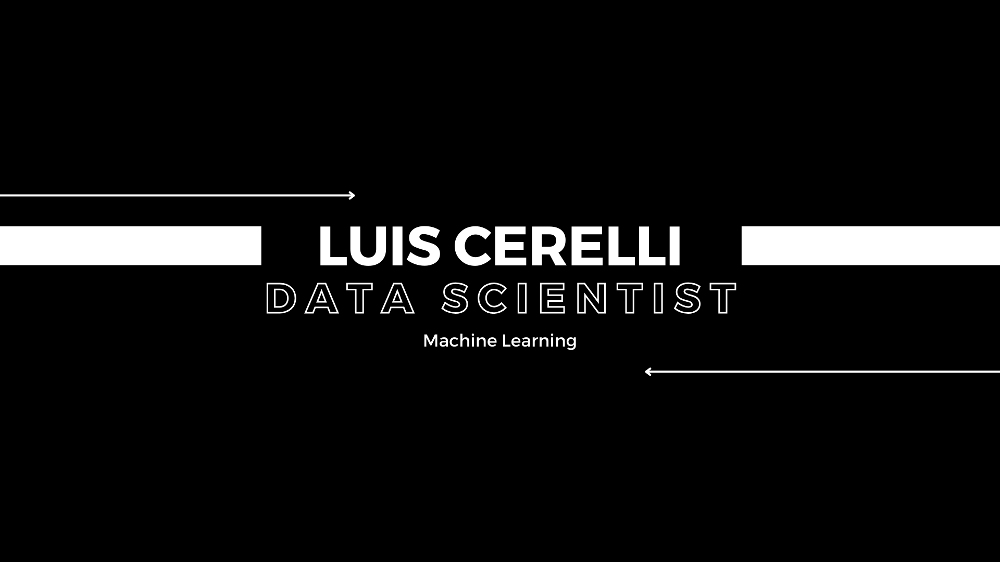

Soy un **Data Scientist** apasionado por la innovación tecnológica y la solución de problemas complejos a través del análisis de datos. Con una formación integral en **ciencia de datos, ciberseguridad y computación en la nube**, poseo una sólida trayectoria en diversas industrias.

He vivido y trabajado en **América Latina, Italia y Francia**, lo que me ha permitido desarrollarme en un entorno multicultural y dominar **español, italiano, francés e inglés**.

## Experiencia

Mi carrera comenzó liderando equipos en la industria gastronómica, donde desarrollé competencias en:
- **Gestión financiera** y análisis de costos.
- **Optimización de operaciones** para maximizar eficiencia y rentabilidad.  

Más adelante, mi curiosidad y compromiso con el aprendizaje continuo me llevaron a explorar nuevas áreas, como:
- **Finanzas** y modelado económico.
- **Comercio y manufactura**, aplicando métodos de análisis y gestión para procesos más eficientes.  
- **Ciencia de datos aplicada**, aprovechando modelos avanzados para resolver desafíos en diversas industrias.  

## Proyectos Destacados

### Chatbot "Huella de Carbono"
Desarrollo e implementación de un chatbot con **OpenAI** y **Microsoft Azure**, diseñado para minimizar errores en respuestas (alucinación) y optimizar la experiencia del usuario. Más detalles disponibles en mi [repositorio del proyecto](https://github.com/LuisCerelli/Hackathon_Innovation_Hallucination_Detection_and_Context_Validation).

---

## Educación y Certificaciones

### Certificaciones Destacadas
- [Microsoft Learn: AI Fundamentals](https://learn.microsoft.com/es-mx/users/luiscerelli-1999/credentials/4b51b4972d83a75b)
- [Google Data Analytics Professional Certificate](https://www.coursera.org/account/accomplishments/verify/PAOF2YX9U2RE)
- [Deep Learning Specialization by Andrew Ng](https://www.coursera.org/account/accomplishments/verify/JJ3GI8K0VFLL)
- [EF SET Certificate - Inglés avanzado (C1)](https://cert.efset.org/rJ1Bjb)
- [Fundamentos de Ciencia de Datos - CódigoFacilito](https://codigofacilito.com/certificates/d4dd3263-a31a-45be-a0f4-d6e0c673f06b)  
- [What The Hack - OpenAI powered by Microsoft](https://codigofacilito.com/certificates/32ab0d4b-41a5-492f-8437-e583976b2a8d)

### Cursos en Progreso
- **Especialización en Ciberseguridad - Google**  
  [Ciberseguridad de Google Specialization](https://www.coursera.org/learn/herramientas-del-oficio-linux-y-sql/home/assignments)  
- **Bootcamps con Microsoft Azure - CódigoFacilito**  
  - [DP-900: Bootcamp de DB en la nube con Azure](https://codigofacilito.com/bootcamps/dp-900/dashboard)  
  - Bootcamp de Ciencia de Datos con Azure  

---

## Habilidades Principales
- **Lenguajes de Programación**: Python, SQL, JavaScript
- **Herramientas**: Azure AI Studio, OpenAI, Pandas, Scikit-learn, TensorFlow  
- **Áreas de Enfoque**: Ciencia de Datos, Ciberseguridad, Computación en la Nube, Optimización de Procesos  
- **Idiomas**: Español, Italiano, Francés, Inglés  

---

## Compromiso con el Aprendizaje

Estoy continuamente buscando expandir mis conocimientos y aplicar nuevas tecnologías para resolver problemas complejos. Mi objetivo es contribuir a proyectos innovadores que generen impacto tanto a nivel técnico como humano.  
¡Explora mis repositorios y no dudes en contactarme para colaborar!  

### Cursos y desafios finalizados: 

[What The Hack - OpenAI powered by Microsoft](Certificado_What_The_Hack_OpenAI_powered_by_Microsoft.pdf)

#### Actualmente cursando las carreras de Ciberseguridad en Google: 
[Ciberseguridad de Google Specialization](https://www.coursera.org/learn/herramientas-del-oficio-linux-y-sql/home/assignments)

#### y Microsoft Azure: 

[Microsoft Azure: Bootcamp de DB en la nube con Azure](https://codigofacilito.com/bootcamps/dp-900/dashboard)

[Bootcamp de Ciencia de Datos con Azure](_)

