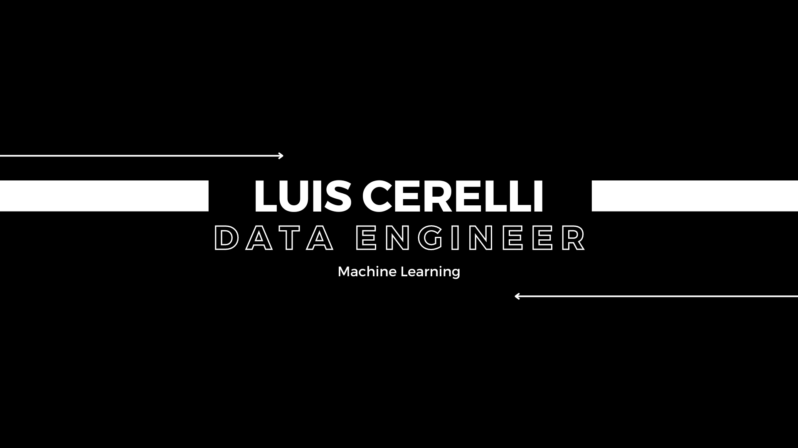
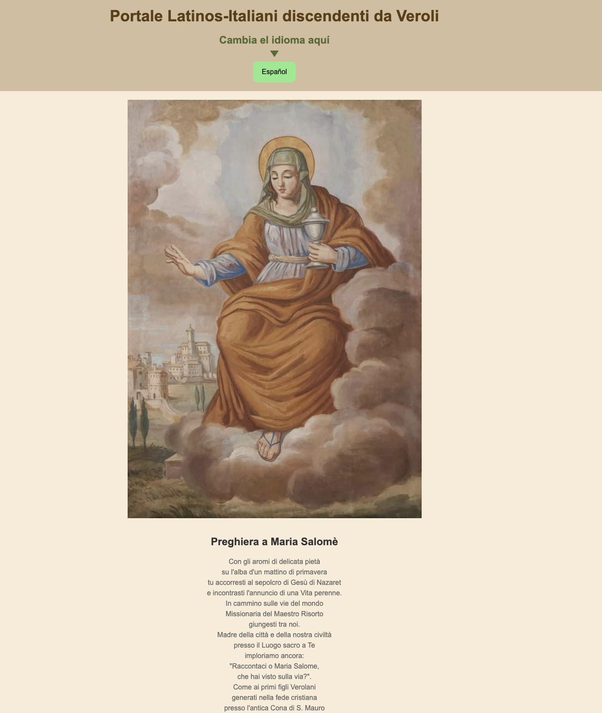
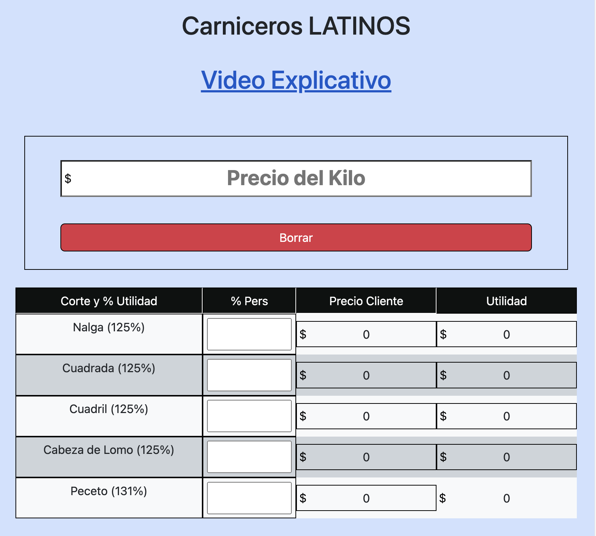
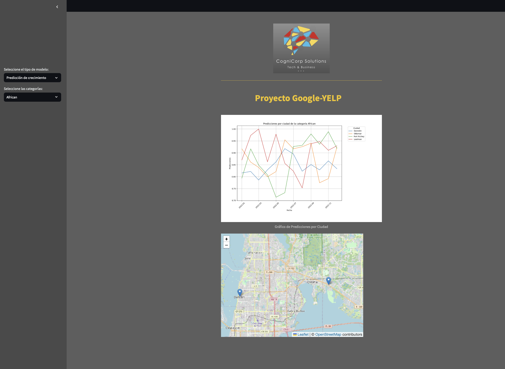

# Bienvenido a mi Perfil de GitHub

**Hola, soy Luis**, un apasionado **Data Engineer** con una sólida trayectoria en la industria de la gastronomía y una vasta experiencia en áreas como **finanzas, comercio, manufactura, energía y recursos**. He vivido en América Latina, Italia y Francia, lo que me ha permitido hablar español e italiano con fluidez, además de tener un buen dominio del francés y el inglés.

## Mi Trayectoria

Durante años, he liderado equipos en la industria gastronómica, desarrollando habilidades en **gestión financiera, análisis de costos y optimización de operaciones**. Esta experiencia me llevó a explorar otras áreas, incluyendo finanzas, comercio y manufactura, donde he aplicado exitosamente mis habilidades y conocimientos de gestión.

## Como Data Engineer

Actualmente, combino toda mi experiencia en diversos sectores con mi formación en análisis de datos para ofrecer soluciones efectivas. Me enfoco en aprovechar los datos para optimizar procesos, predecir tendencias y tomar decisiones estratégicas en entornos dinámicos.

## Compromiso y Aprendizaje

Estoy comprometido con el **aprendizaje continuo y la mejora constante**, siempre buscando contribuir al éxito empresarial. Me encanta enfrentar nuevos desafíos, aprender de mis colegas y contribuir al desarrollo de proyectos innovadores en el campo de la ciencia de datos.

## Proyectos Destacados

Aquí puedes ver algunos de mis trabajos:

- **HTML y CSS sencillo**: He desarrollado proyectos web utilizando HTML y CSS para crear interfaces atractivas y funcionales, incluso en varios idiomas 
- **Modelo de predicción sobre inversiones en restaurantes**: Como Data Engineer, he construido modelos predictivos para analizar y prever tendencias en inversiones gastronómicas.

## Imágenes y Visualizaciones

A continuación, algunas imágenes que ilustran mi trabajo seguidas por sus enlaces de aplicación:

- [Oracion e historia a Santa Maria Salome en Español e Italiano](https://preghierasmsalome.000webhostapp.com/)

      

- [App para precios carniceria](https://mis-precios-de-carne.000webhostapp.com/)

     

- [Modelo ML de prediccion de Crecimiento e identificacion de oportunidades](https://cognicorp-gy.streamlit.app)

     

---

Gracias por visitar mi perfil. Estoy siempre abierto a nuevas oportunidades y colaboraciones en el campo de la **Data Engineer**. Si tienes algún proyecto interesante o deseas discutir cómo podemos trabajar juntos, no dudes en contactarme.

¡Espero que disfrutes explorando mis proyectos tanto como yo disfruté creándolos!

